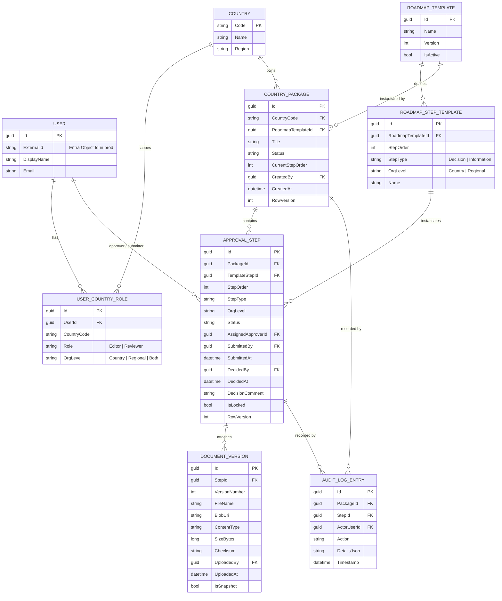
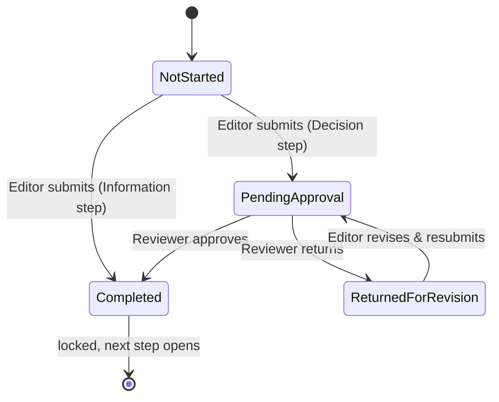
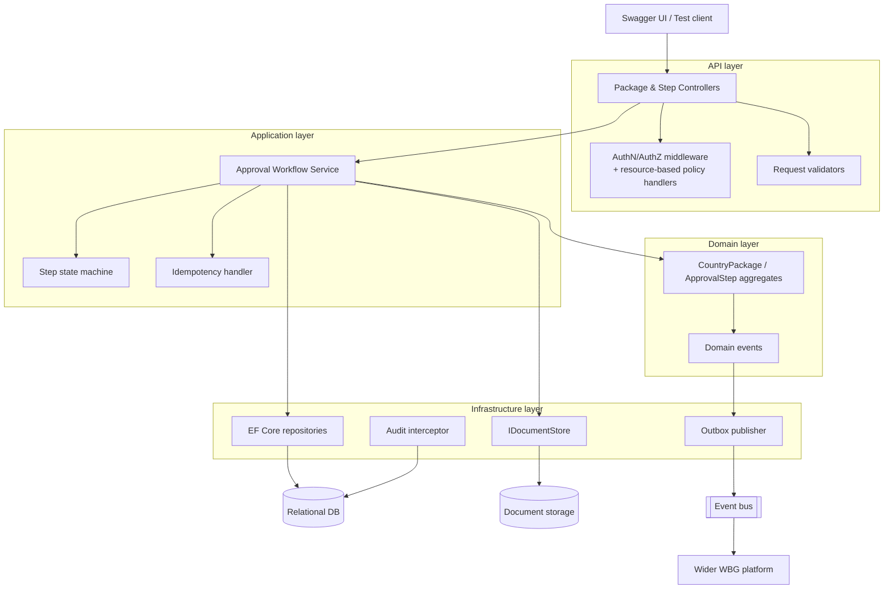
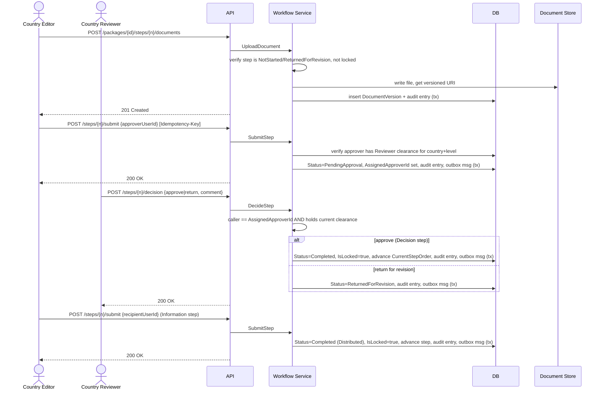
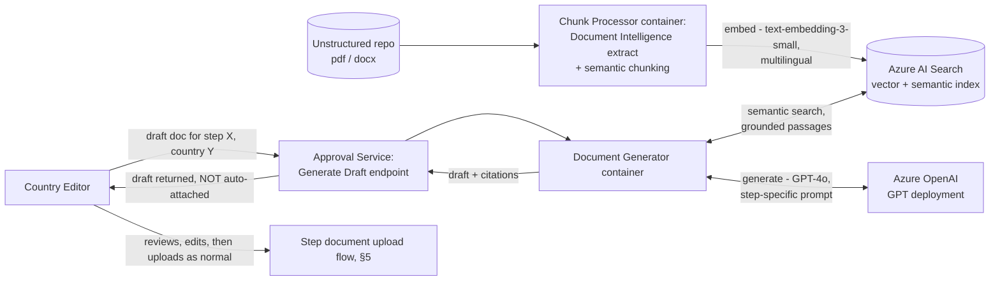

# Country Package Approval Service — Solution Architecture

**Status:** Design proposal for the take-home exercise, with a target production architecture on Microsoft Azure.
**Scope:** Data model, roadmap/state machine, component design, RBAC, service integration, and the Azure deployment that this service would run on once it joins the wider World Bank Group platform.

This document is split in two layers on purpose:

- **Sections 1–5** describe the *service itself* — domain, data model, components, RBAC, and flows. This is cloud-agnostic and is what the take-home code implements (against SQLite/in-memory, per the assignment's allowance).
- **Section 6** describes the *Azure target architecture* — how the same service is deployed, secured, and integrated once it's promoted beyond a take-home exercise. Section 9 maps explicitly which simplifications in the exercise correspond to which production Azure capability, so the gap is never ambiguous.

## Diagrams

The four "required" diagrams for the submission — data model, component diagram, service integrations, and RBAC approach — are authored as an editable **draw.io** file, one page per diagram:

**`docs/diagrams/CountryPackageApprovalService-Architecture.drawio`**

| Page | Covers | Referenced from |
|---|---|---|
| 1 — Data Model (ERD) | Entities, relationships, crow's-foot cardinalities | §2 |
| 2 — Component Diagram | API/Application/Domain/Infrastructure layering + external dependencies | §3 |
| 3 — Service Integrations (Azure) | WAF/APIM ingress, VNet + Private Endpoints, Azure resource bindings, outbound Service Bus events, bonus AI pipeline (Chunk Processor + Document Generator) — also the deployment diagram | §6.1, §6.5, §7 |
| 4 — RBAC Approach | AuthN→AuthZ decision flow plus the action → role/scope/check matrix | §4 |

Open it in the draw.io desktop app, the VS Code "Draw.io Integration" extension, or [app.diagrams.net](https://app.diagrams.net) (File → Open). Most Mermaid diagrams inlined below are a quick-look preview that renders directly on GitHub — the `.drawio` file is the authoritative, editable version referenced by the submission requirements and the one to project during the walkthrough. The deployment diagram (§6.1) is the one exception: it points at page 3 directly rather than duplicating it as a separate, lower-fidelity Mermaid sketch, since the two would only drift apart over time.

---

## 1. Problem Analysis

### 1.1 Actors and scope

| Actor | Description |
|---|---|
| **Country Editor** | Creates a package's roadmap, uploads documents, selects an approver, submits steps. Scoped to one or more country codes. |
| **Country Reviewer** | Acts on submissions assigned to them: approve, or return for revision. Scoped to one or more country codes. |

A role is never global — it is always held *for* a set of country codes, and (see §4) further scoped by organizational level (country vs. regional), because a person cleared to review at country level is not automatically cleared to review at regional level.

### 1.2 The approval roadmap

Every Country Package follows the same four-step, sequential roadmap:

| # | Step | Type | Org level | Editor action | Reviewer action |
|---|---|---|---|---|---|
| 1 | Obtain decision — country level | Decision | Country | Upload doc, pick approver, submit | Approve → step 2 opens, or Return for revision → back to step 1 |
| 2 | Distribute — country level | Information | Country | Pick recipient, submit | *(none — self-completing)* |
| 3 | Obtain decision — regional level | Decision | Regional | Upload doc, pick approver, submit | Approve → step 4 opens, or Return for revision → back to step 3 |
| 4 | Distribute — regional level | Information | Regional | Pick recipient, submit | *(none — self-completing)* |

Two step *shapes* recur (Decision, Information), each with a consistent interface — this is the key modeling insight: the roadmap is a sequence of typed steps, not four bespoke screens.

### 1.3 Behaviors the service must support

- Attach a document to a step, tied to that specific step's lifecycle.
- Enforce that only the step's designated Editor/Reviewer combination can act on it, and only when the step is in the right state.
- Snapshot (lock) a Decision step's document the moment it's approved; later steps may carry new documents, but a completed step's attachment never changes again.
- Record every state-changing action in an audit trail, retrievable per step.
- Behave correctly under retries, concurrent decisions, and partial failures (a required, not optional, concern per the brief).

### 1.4 Non-functional requirements

- **Security:** role- and country-code-scoped authorization on every write; documents may contain sensitive, pre-decisional country information.
- **Auditability:** immutable, queryable trail of who did what, when, tied to the exact step and document version.
- **Testability:** authentication must be swappable between a dev-only mechanism and a real identity provider without touching business logic.
- **Integration-readiness:** the service is explicitly a component of a larger platform — it must expose events/state, not just a request/response API.
- **Idempotency & resilience:** submit/decision calls must be safe to retry; a crash between "store the document" and "record the decision" must not corrupt the roadmap.

### 1.5 Assumptions (documented per the brief's instruction)

1. A user holds **exactly one role** (Editor *or* Reviewer) but may hold it for multiple country codes and, independently, be scoped to Country level, Regional level, or both — modeled as multiple `UserCountryRole` rows rather than a single flag.
2. **One roadmap shape today, modeled as a template** so a second package type (different step count/order) can be introduced later via data, not a code change — this is a small extra layer of indirection that costs little now and avoids a rewrite later.
3. The Editor **names a specific approver** (a user ID) at submission time, as the brief states. Authorization on the decision requires *both* "you are that named approver" *and* "you currently hold Reviewer clearance for this country + org level" — see §4.3 for why both checks exist.
4. "Distribution" steps have no reviewer action; submitting *is* completion, per the brief's description of an information step.
5. A returned-for-revision Decision step becomes editable again (new document version), but the step's *prior* approved siblings are untouched — only the currently active step's lock is ever lifted.
6. Fictional data only; no real country, personnel, or document content is used anywhere in the exercise or this document.
7. For the take-home, authentication is a **development header** resolving to a seeded fictional user (per the brief's explicit allowance); the Azure target design replaces this with Microsoft Entra ID without changing any authorization logic downstream of the identity (see §6.3).

---

## 2. Domain & Data Model

### 2.1 Entity-relationship diagram

*Authoritative version: `docs/diagrams/CountryPackageApprovalService-Architecture.drawio`, page 1.*

### 2.2 Why a template layer

`RoadmapTemplate` / `RoadmapStepTemplate` exist separately from the per-package `ApprovalStep` instances. For this exercise there is exactly one active template (the four steps in §1.2), seeded once. The separation costs one extra join but means a second package type — or a revision to the existing roadmap — is a data change, not a redeploy. Given the brief explicitly asks to "model the approval process roadmap" rather than hardcode four screens, this seemed like the right amount of structure: enough to demonstrate the modeling, not so much that it becomes speculative generality.

### 2.3 Step state machine

Decision steps and Information steps have different lifecycles:

`CountryPackage.Status` is derived, not separately tracked: `InProgress` while any step is active, `ReturnedForRevision` when the current step is in that state, `Completed` once step 4 is `Completed`. Deriving it avoids a second source of truth that can drift from the steps themselves.

### 2.4 Process orchestration: explicit state machine vs. a BPMS

A general-purpose BPMS (Flowable, Camunda, or similar) was considered and deliberately left out, rather than left unconsidered.

**Why the state machine is enough here.** The roadmap is four steps, strictly sequential, with only two step shapes and exactly one non-linear transition (`PendingApproval` → `ReturnedForRevision`, which loops back one step). That's fully expressed by `ApprovalStep.Status` plus the `RoadmapTemplate`/`RoadmapStepTemplate` tables from §2.2 — the roadmap is already modeled as data, which is the property a BPMS would otherwise be brought in to provide. A BPMN engine earns its cost when the process *shape* varies by data (parallel branches, conditional routing, timers/escalations, sub-processes) or needs to be authored/maintained visually by non-engineers. None of that is true of this roadmap today.

**Why Flowable specifically doesn't fit here.** Flowable is a JVM/Spring engine; the brief specifies .NET/ASP.NET Core. It can't be embedded in-process — adopting it would mean standing up a second service in a second language, with its own database schema (`ACT_*`), its own deployment pipeline, and its own patching surface, called over REST from the API. That's a substantial operational tax for a workflow that doesn't currently branch, and it works against the brief's own scoring criteria ("pragmatic implementation choices," "deployment readiness," "small, working, well-reasoned solution over scope"). It would also fight the domain rules already in §4 — named-approver-plus-clearance authorization and per-step document immutability aren't naturally expressed by BPMN's candidate-user/candidate-group human tasks, so a Flowable-based version would still need custom delegates re-implementing the same checks, just split across two codebases and two type systems.

**When this call should be revisited.** If Country Packages later gain multiple package *types* with genuinely different, branching roadmaps (parallel country+regional tracks, SLA/escalation timers, dynamically inserted steps), a process engine's value — visual, versioned process definitions; built-in escalation — starts to outweigh the operational cost. At that point the Azure-native options (**Azure Logic Apps Standard** or **Durable Functions**) fit better than a JVM BPMS, since they stay in the .NET/Azure ecosystem already in place and integrate directly with the Service Bus events from §6.5; a full BPMN engine would only make sense if the wider WBG platform already standardizes on one for other approval-heavy processes, in which case **Camunda 8/Zeebe** is the more cloud-native fit than Flowable. None of this is needed for the roadmap as specified.

---

## 3. Component Architecture

### 3.1 Layering

Standard ASP.NET Core clean-architecture separation — chosen because the brief explicitly scores "appropriate separation of API, application, persistence, and integration concerns," and because it keeps the domain testable without a database:

- **API** — controllers/minimal APIs, request/response DTOs, Swagger/OpenAPI generation, the auth middleware and policy handlers.
- **Application** — use-case services (submit step, decide step, upload document), input validation (FluentValidation), the idempotency handler.
- **Domain** — `CountryPackage` / `ApprovalStep` aggregates, the state machine, domain events (`StepSubmitted`, `StepCompleted`, `StepReturned`, `PackageDistributed`). No dependency on EF Core or ASP.NET.
- **Infrastructure** — EF Core repositories and migrations, `IDocumentStore` (local disk in the exercise, Blob Storage in Azure), the audit interceptor, the outbox publisher.

### 3.2 Component diagram

*Authoritative version: `docs/diagrams/CountryPackageApprovalService-Architecture.drawio`, page 2.*

### 3.3 Cross-cutting design decisions

**Idempotency.** Submit and decision endpoints accept an `Idempotency-Key` header. The application layer stores `(endpoint, key) → response` for a bounded window; a retried request with the same key returns the original result instead of re-executing. Combined with optimistic concurrency (`RowVersion` on `CountryPackage` and `ApprovalStep`), two concurrent decisions on the same step can't both "win" silently — the loser gets a 409 with the current state, not a corrupted roadmap.

**Partial failures.** A document upload writes to storage *then* commits the DB row referencing it, inside the same logical operation; if the DB commit fails after a successful blob write, the orphaned blob is simply never referenced and is swept by a retention job — it never corrupts state, it just wastes storage transiently. State transition + audit-log write + outbox message are written in a single DB transaction (transactional outbox), so the event that tells the wider platform "step completed" is never lost or double-fired independently of the state change itself.

**Snapshot immutability.** The moment a Decision step is approved, its `ApprovalStep.IsLocked` flips true and its `DocumentVersion` rows become read-only at the application layer; in Azure this is reinforced with a storage-level immutability policy (§6.4) rather than relying on application logic alone.

---

## 4. RBAC Across Country Codes and Organizational Levels

*Authoritative diagram: `docs/diagrams/CountryPackageApprovalService-Architecture.drawio`, page 4 (AuthN→AuthZ flow + the action/role/scope matrix below, reproduced there as a table).*

### 4.1 The scoping model

Authorization has three independent dimensions, and all three must line up for a write to succeed:

1. **Role** — Editor or Reviewer. Provisioned two ways at once, deliberately: coarsely and centrally as an Entra ID **App Role** (`CountryEditor`/`CountryReviewer`, surfaced in the JWT `roles` claim via the API's own App Registration), and authoritatively, per country, in `UserCountryRole`. §6.3 explains why both exist rather than picking one.
2. **Country code** — one row in `UserCountryRole` per country a user is scoped to.
3. **Organizational level** — Country, Regional, or Both, because clearance to review a country-level decision does not imply clearance to review a regional one (and vice versa).

Dimensions 2 and 3 are intentionally *not* modeled as an identity-provider group structure — with ~189 countries × 2 org levels, that doesn't scale operationally (see §6.3). Dimension 1 *is* modeled in Entra ID, as a real App Role behind a properly configured App Registration (scope, App Role definitions, admin consent, Client ID) — but only as a coarse provisioning gate, not as the final word on what a given caller may do to a given package.

### 4.2 Enforcement points

| Action | Required | Checked against |
|---|---|---|
| Create roadmap for a package | Editor role, scoped to the package's country code | `UserCountryRole` |
| Upload a document to a step | Editor role, same country code, step is `NotStarted` or `ReturnedForRevision`, step not `IsLocked` | `UserCountryRole` + step state |
| Submit a step | Editor role, same country code; named approver must hold Reviewer role for that country code **and** that step's org level | `UserCountryRole` (both users) |
| Approve / return a step | Reviewer role, same country code, same org level, **and** caller is the step's `AssignedApproverId` | `UserCountryRole` + step assignment |
| Read a package/step/audit trail | Editor or Reviewer role, same country code | `UserCountryRole` |

Implemented as ASP.NET Core **resource-based policy handlers**: an `IAuthorizationHandler` receives the authenticated user *and* the loaded `CountryPackage`/`ApprovalStep`, so the check is always against the actual resource being touched, not just a static claim on the token.

"Role" in the table above is checked twice, answering two different questions. Entra ID's App Role claim (`roles` in the JWT) is checked first — a coarse, cheap, centrally-governed gate: is this identity provisioned, in Entra ID, to ever hold Editor and/or Reviewer capability at all. `UserCountryRole` is checked second, inside the resource-based handler, against the specific country code and org level on the loaded resource — the authoritative answer to whether this caller may act on this package right now. The Entra claim narrows who reaches the fine-grained check; it's never sufficient on its own, and it can't go stale-and-still-work the way a cached claim could, because `UserCountryRole` is re-read every request regardless of what the token says (§6.3).

### 4.3 Why both "named approver" and "role clearance" are checked

The brief says the Editor "selects the correct user ID of the approver," and separately that "only Country Reviewers with the required clearance may approve." Checking only the name invites a stale-assignment problem (a reviewer's clearance is revoked after submission but before decision, and the API would still let them act). Checking only the role invites an accountability gap (any reviewer with country+level clearance could act on a step that was routed to someone specific). Requiring both is slightly more restrictive — a legitimate reassignment needs an explicit "reassign approver" action rather than "any cleared reviewer picks it up" — which is the right default for a decision-of-record process; a role-pool mode is a one-line policy change if the wider platform later needs it, and is worth flagging as an open question in the walkthrough rather than silently deciding it.

### 4.4 Authentication vs. authorization

Authentication and authorization are still deliberately decoupled, but the line isn't "the token proves nothing but identity" — once Entra ID App Roles are in the picture (§6.3), the token establishes *identity plus a coarse role claim*. What stays strictly out of the token, and is re-read from `UserCountryRole` on every request instead, is the fine-grained part: which country, which org level, and (for decisions) whether this caller is the step's named approver. That's what keeps the authorization logic testable independently of whichever identity mechanism is in front of it — the resource-based policy handler reads role off `ClaimsPrincipal.IsInRole(...)` (populated by standard JWT bearer middleware from the `roles` claim, no custom parsing) and reads country/org-level from a repository call, so it runs unchanged whether the caller was authenticated by the dev header or by a real Entra ID token.

The exercise's dev header only ever emulates the fine-grained half — it resolves straight to a `UserId` and lets `UserCountryRole` do the rest, with no coarse-gate claim, since standing up real Entra ID App Registrations/App Roles is outside what this take-home builds (see §6.3 for what the swap to Entra ID actually adds).

---

## 5. Key Flows

---

## 6. Azure Target Architecture

This is the production deployment the service graduates into once it joins the wider platform — same code, different hosting/identity/storage bindings behind the infrastructure-layer interfaces from §3.1.

### 6.1 Deployment diagram

*Authoritative diagram: `docs/diagrams/CountryPackageApprovalService-Architecture.drawio`, page 3 ("Service Integrations (Azure)") — the full deployment view, with the real Azure resources, VNet layout, and subnets, supersedes the earlier sketch that used to live in this section as a separate, lower-fidelity Mermaid diagram. Keeping one diagram as the single source of truth (editable, using the real Azure stencil set) beat maintaining two versions of the same picture that could quietly drift apart — see the note below the diagrams table in the header of this document.*

Walking it edge-to-VNet: **Wider WBG platform / API consumers** reach the API through **WAF** (its own subnet) into **API Management** (its own subnet), which forwards into the **Container Apps** environment inside the **Virtual Network**. Inside the VNet, the API reaches Azure SQL, Blob Storage, Key Vault, Service Bus, and Application Insights exclusively via **Private Endpoints** — there is no public network path to any of them. **Entra ID** issues and validates the JWT (§6.3); a **Container Registry** feeds the Container Apps environment its images; a **Private DNS Zone** resolves the private-endpoint names inside the VNet. **Microsoft Defender for Cloud** (not itself drawn — it's a subscription-level control plane, not a network node) monitors the VNet and its resources for the security posture in §6.7.

Note the ingress path is **WAF → API Management**, with no Azure Front Door in front — see §6.2 for why that's a deliberate simplification, not an oversight, for this service's traffic profile.

### 6.2 Component-to-Azure mapping

| Logical component | Azure service | Why |
|---|---|---|
| API host | **Azure Container Apps** | Scale-to-zero for a workflow API with bursty, business-hours traffic; revisions give blue/green deploys without a separate slot mechanism. See §6.2.1 for the full comparison against App Service — the choice doesn't affect the app code either way. |
| Edge / API gateway | **Azure WAF**, then **API Management** | WAF for common web-attack protection; APIM for versioning, throttling, and a Swagger-backed developer portal — this is exactly the seam where "integrated into a wider platform" happens. Azure Front Door is deliberately left out: it earns its cost as a *global* entry point fronting multiple regions/origins, and this is a single-region, internal, WBG-network-facing service — APIM already terminates TLS and does regional routing. Adding a multi-region Front Door tier is a one-line addition later if the platform goes multi-region, not a redesign. |
| Relational store | **Azure SQL Database** (zone-redundant, Business Critical or General Purpose depending on SLA) | Native `RowVersion`/optimistic-concurrency support maps directly onto the `RowVersion` columns in §2.1; Always Encrypted and Entra-ID-based DB auth fit an enterprise/World Bank security posture. Azure Database for PostgreSQL Flexible Server is a fully valid, lower-cost alternative if the platform's data estate already standardizes on Postgres — the EF Core provider swap is the only code impact. |
| Document storage | **Azure Blob Storage**, hot tier, versioning enabled | Native blob versioning plus a **time-based immutability policy** applied to a container/version once a step locks gives storage-level enforcement of "completed-step documents never change," not just an application-level flag. |
| Secrets/config | **Azure Key Vault** + **Managed Identity** | No connection strings or keys in app config; the app authenticates to SQL, Blob, and Service Bus via its managed identity. |
| Identity | **Microsoft Entra ID** | Authenticates callers and carries a coarse Editor/Reviewer role via App Registrations/App Roles (OIDC/JWT); see §6.3 for the full design and why country/org-level scoping still doesn't move into it. |
| Eventing | **Azure Service Bus** (topics) | The outbox publisher (§3.3) drains into Service Bus topics — `StepCompleted`, `StepReturned`, `PackageDistributed` — for the wider platform to subscribe to; ordered, at-least-once delivery, dead-lettering for poison messages. |
| Observability | **Application Insights + Log Analytics** | Distributed tracing with correlation IDs across API → outbox → Service Bus; the audit trail (§2, business-facing) is deliberately kept separate from operational telemetry (ops-facing) — different retention, different audience. |
| IaC / CI-CD | **Terraform** (private module registry) **+ GitHub Actions / Azure DevOps** | Environment-per-stage (dev/test/prod), infra and app deploy as one pipeline artifact; see §6.8 for why Terraform specifically, and why as versioned modules rather than per-environment scripts. |

### 6.2.1 Compute choice: App Service vs. Container Apps

Both are legitimate PaaS hosts for the same ASP.NET Core app — this is a genuinely close call, laid out explicitly rather than asserted:

| Dimension | Azure App Service (Premium v3) | Azure Container Apps |
|---|---|---|
| Packaging | Native ASP.NET Core deploy (zip/MSBuild) or container | Container image only |
| Scaling floor | Always at least one warm instance on Premium — no scale-to-zero | KEDA-based autoscale, can scale to **zero** when idle |
| Cost profile | Predictable; pay for the provisioned plan even when idle overnight/weekends | Pay-per-use when scaled down — cheaper for an internal approval workflow with business-hours, bursty traffic |
| Cold start | None (always warm) | Noticeable (seconds) on the first request after scaling to zero |
| Blue/green | Deployment **slots** (swap) | **Revisions** with traffic splitting — similar capability, container-native mechanism |
| Networking | Regional VNet Integration | Native VNet integration via the Container Apps managed environment |
| Team familiarity | Very mature, best understood by most .NET teams — nothing new to operate | Newer; Kubernetes/KEDA/Envoy under the hood, though far simpler to operate than raw AKS |
| Fit if the platform decomposes further | Each additional service is its own App Service plan (or a slot juggling act) | Multiple services share one Container Apps Environment — a more natural fit if the wider WBG platform ends up as several small services |

**Recommendation: Container Apps, with a caveat.** The scale-to-zero economics and the multi-service fit win for this workload — an approval API isn't hit continuously, and "integrated into a wider platform" suggests more services will show up around it over time. The caveat is cold start: if reviewers hitting the API after it's been idle overnight find a multi-second delay unacceptable, the fix is `minReplicas: 1` on the Container Apps scale rule — trading back some of the cost saving for App-Service-like responsiveness, without changing platforms. **If the platform team already standardizes on App Service elsewhere**, that's a perfectly reasonable reason to follow suit instead — the app code doesn't know or care which one it's running on, since both sit behind the same `IDocumentStore`/configuration seams from §3.1.

### 6.3 Identity and authorization in Azure

Every application in this architecture is its own principal in Entra ID — this API, and each of its consumers — registered, scoped, and consented independently rather than sharing one "the platform" identity. Two distinct kinds of App Registration are involved:

- **The API's own App Registration (resource app).** Exposes an API (Application ID URI, e.g. `api://country-package-approval-service`), defines a delegated scope (`access_as_user`) that a client must request, and defines two **App Roles** — `CountryEditor` and `CountryReviewer` — with allowed member types Users/Groups (Applications too, if a future service-to-service caller needs application permissions rather than delegated ones). The App Role `value` strings match the `UserRole` enum exactly, so turning a JWT claim into the domain type is a lookup, not a translation table.
- **One App Registration per consuming client.** The wider WBG platform's portal (a public client — Authorization Code + PKCE, redirect URI, no secret) and any backend service calling this API directly (a confidential client — client secret or, preferably, a certificate). Each gets its own **Client ID**, requests the API's `access_as_user` scope, and is **admin-consented once** at the tenant level — appropriate for an internal LOB app where every consumer is a known, WBG-controlled application, rather than per-user consent prompts.

**Role provisioning.** End users are never assigned App Roles individually. Two Entra ID **Security Groups** — `SG-CountryEditor`, `SG-CountryReviewer` — are each mapped to the matching App Role on the API's App Registration; adding or removing someone from a group in Entra ID is the entire provisioning action, on the same access-review/governance surface WBG already uses elsewhere. A person with mixed responsibilities (Editor for one country, Reviewer for another) is simply a member of both groups.

**Token validation.** Standard ASP.NET Core `AddJwtBearer`, no custom crypto: the API validates issuer and audience (a token must have been minted *for this API's* Application ID URI — a token valid for a different WBG API is rejected outright) and signature against Entra ID's OIDC discovery document / JWKS (fetched and cached automatically, rotated without a deploy). APIM performs the same validation at the edge as a first line of defense (§6.1); the API validates again itself rather than trusting the gateway alone — defense in depth that costs nothing and isn't conditional on APIM configuration staying correct forever.

**Why country/org-level still doesn't move into Entra ID.** The `roles` claim above is a real Entra ID role, correctly backed by an App Registration, scope, consent, and Client ID — but it's necessarily **coarse**: "is this identity provisioned, in principle, to ever hold Editor and/or Reviewer capability." It is not, and structurally can't be, "Editor for Ruritania, Regional level, as of right now":

- At ~189 countries × 2 org levels, that's 300+ combinations to model as Entra ID groups or per-country app-role assignments — operationally unmanageable, and it turns every country reassignment into an Entra ID change request instead of an in-app one.
- Keeping `UserCountryRole` as the fine-grained, authoritative store means a clearance change (revoke a reviewer, reassign a country) takes effect on the *next request*, not on the caller's next token refresh — no dependency on token lifetime or an Entra-ID-to-app group-sync job.
- It closes a real gap, too: if someone's Security Group membership is revoked in Entra ID but their existing access token hasn't expired yet, `UserCountryRole` — re-read every request — still enforces the current, correct answer. The Entra claim narrows who reaches the fine-grained check; it is never sufficient by itself.

So the two checks are deliberately non-redundant, not a belt-and-suspenders duplication of the same fact: Entra ID's App Role claim is a coarse, centrally-governed *provisioning* gate, checked first and cheaply; `UserCountryRole` is the fine-grained, always-current *entitlement* check, checked second against the actual resource (§4.2). This is the same "authenticate centrally, authorize locally" split the original design made, now with the coarse half explicitly implemented as real Entra ID App Roles rather than a token that "just proves identity" — the sharper version of that split, and the one worth presenting in the walkthrough as the answer to "why isn't all of this just Entra ID."

Swapping the exercise's dev header for the real thing (README, "Authentication") stays confined to `Program.cs`'s scheme registration plus standing up the App Registrations above in the tenant; the coarse-gate check is one additional role-claim policy layered in front of the existing resource-based handler, not a rewrite of it (§4.4).

### 6.4 Data and storage

- Azure SQL with zone redundancy for the transactional store; automated backups and point-in-time restore cover the "operate this in production" requirement.
- Blob Storage versioning + immutability policy backs the snapshot guarantee described in §3.3, so document immutability doesn't rely solely on the application not having a bug.
- Both are reached only via Private Endpoints inside the VNet — no public network path to the database or storage account.

### 6.5 Integration with the wider platform

*Authoritative diagram: `docs/diagrams/CountryPackageApprovalService-Architecture.drawio`, page 3.*

Two integration surfaces, matching the two ways "wider platform" was described in the brief:

1. **Synchronous, inbound:** REST API through APIM, versioned (`/v1/...`), documented via the OpenAPI spec the API already emits — any platform component can call it directly for reads or to drive the workflow.
2. **Asynchronous, outbound:** domain events on Service Bus topics (`StepSubmitted`, `StepCompleted`, `StepReturned`, `PackageDistributed`) so downstream systems react to state changes without polling and without coupling to this service's internal schema — only the event contract is shared.

The diagram shows two such subscribers as **Azure Functions** triggered off the Service Bus topics: a **Notification Service** and **CPF/CPIA Reporting**. Both are illustrative — they represent the shape a downstream subscriber takes on this platform, not something this exercise implements. Azure Functions is the right compute for them specifically *because* they're reactive, event-driven, and read-only with respect to this service (they never call back into the API to mutate state) — a natural fit for consumption-plan Functions, unlike the API itself, which is a stateful, synchronously-called service better suited to Container Apps (§6.2.1). Like the API, they sit inside the VNet and reach Service Bus (and Application Insights, for their own telemetry) only via Private Endpoints — there's no separate trust boundary for "the rest of the platform" versus this service.

### 6.6 Observability and operations

- Correlation ID propagated from APIM through the API into outbox messages, so a single request can be traced end-to-end in Application Insights even after it crosses into async processing.
- Structured logging (Serilog → Log Analytics) separate from the business audit trail — an ops engineer debugging a 500 and an auditor reviewing who approved a step are different audiences with different data.
- Health probes (`/healthz` liveness/readiness) wired into Container Apps for rolling restarts and into Azure Monitor for alerting.
- Configuration via `appsettings.{Environment}.json` + Key Vault references — no environment-specific logic branches in code.

### 6.7 Security posture

- Least-privilege managed identities per resource (API's identity can read/write only its own SQL DB, its own container, its own Service Bus topics).
- Microsoft Defender for Cloud across the resource group for posture management and threat detection, appropriate given the sensitivity of pre-decisional country data.
- WAF in front of API Management for common web attack patterns before traffic ever reaches the gateway (§6.1 — no Front Door in this deployment; see §6.2 for why).
- All traffic TLS 1.2+; documents encrypted at rest (Storage Service Encryption) and in transit.

### 6.8 Infrastructure as Code: Terraform module strategy

Provisioned with **Terraform**, as a small internal module library rather than one flat root module per environment — so the private-networking posture from §6.1/§6.4/§6.7 is enforced by the module itself, not left to whichever pipeline or engineer wires up an environment next:

- **Private by default, not by request.** Every module for a stateful/PaaS resource (SQL, Blob Storage, Key Vault, Service Bus) defaults `public_network_access_enabled = false` and provisions its own Private Endpoint plus Private DNS Zone association as part of the module, not as a separate step left to the consumer. Getting a public endpoint requires actively overriding the default and justifying it in review — the secure path is the path of least resistance, not an opt-in checkbox that quietly doesn't get ticked under deadline pressure.
- **No implicit external calls, no connection-string auth.** Modules wire Managed Identity and the matching least-privilege RBAC role assignment internally rather than exposing a key or connection string as a module output — "how does the caller authenticate to this resource" is answered once, in the module, not re-decided per consuming team. Network rules default deny-all except the specific VNet/subnet the module is told to integrate with.
- **Composable, not monolithic.** Each service in §6.2 is its own module (`modules/sql`, `modules/blob-storage`, `modules/service-bus`, `modules/key-vault`, `modules/container-apps`, `modules/apim`, ...), versioned and published to a private Terraform module registry. An environment's root module is a thin composition of module calls plus environment-specific variables (SKU, redundancy, autoscale limits) — the private-networking and identity decisions aren't something each new environment re-litigates.
- **Compliance as code, not as a document.** The constraints above are `precondition` blocks and variable defaults inside the modules themselves, so a plan that would violate them (a public endpoint, an over-broad role assignment) fails at `terraform plan` — caught in CI before merge, not at a manual security review weeks later.

This is the same instinct as the rest of §6 applied to infrastructure: push a correctness or security guarantee as far left and as structurally enforced as possible — a module default here, the same way a domain invariant or a database constraint does it for the application (§2, §3) — rather than relying on someone remembering to configure it correctly every time.

### 6.9 CI/CD and environments

Three environments (dev → test → prod), each its own resource group provisioned from the same Terraform modules with a per-environment `.tfvars`. State is remote (Azure Storage backend, one state file per environment, blob-lease locking) so pipeline runs and any manual `terraform plan` share the same source of truth rather than drifting from a local state file. Pipeline: build → unit/integration tests → container image → `terraform plan` (posted to the PR for review, including a check that no module default was overridden to disable a private endpoint) → merge → `terraform apply` to dev → automated smoke tests → manual gate → test → manual gate → prod, with Container Apps revisions enabling instant rollback at the app layer independent of any infrastructure change.

---

## 7. Bonus: AI-Assisted Document Generation

**Problem restated:** Editors currently hand-assemble the document for each "obtain decision" step from a repository of unstructured `.pdf`/`.docx` sources. The goal is to reduce that manual effort and improve consistency, without weakening the human accountability the rest of this design is built around.

**Proposed pipeline (Azure-native, RAG pattern), as two purpose-built containers either side of the index:**

**Three containers, not one, and specifically not folded into the API.** The Country Package Approval API is a synchronous, low-latency, transactional workload (§6.2.1) — chunking and generation are a different shape of work entirely, so they get their own Container Apps rather than becoming background threads inside the API process:

- **Chunk Processor** — reactive, triggered off new files landing in the unstructured repo (Blob Storage event → Storage Queue → KEDA queue-length scale rule), calling Document Intelligence for layout/text extraction, then doing the semantic split and calling the embedding model before writing into AI Search. This is reactive and event-driven the same way the §6.5 subscriber Functions are — the reason it's a **Container App and not a Function** despite that similarity is workload shape, not triggering style: a large multi-hundred-page PDF, run through layout extraction and a multi-step chunking pipeline, can plausibly exceed a Functions consumption-plan execution-time ceiling and wants full control over the runtime image and its dependencies (the chunking library, its models, its memory footprint) in a way a single-purpose event handler like the Notification Service doesn't need.
- **Document Generator** — called synchronously by the API's `POST /generate-draft` endpoint: runs the semantic search against AI Search, then calls the GPT deployment with the retrieved passages and the step-specific prompt template, and returns the grounded draft back to the API. Synchronous and user-facing (an Editor is waiting on it in the UI), so it's provisioned the same way as the main API for responsiveness — `minReplicas` considerations from §6.2.1 apply here too, not just to the core API.
- **Country Package Approval API** stays exactly as designed elsewhere in this document; it calls the Document Generator the same way it calls any other internal dependency, and the generated draft re-enters the ordinary upload path (§5) rather than being a special case.

All three images are pushed to and pulled from the **same shared Container Registry** (§6.2, §6.8) — one registry, three repositories (`country-package-api`, `chunk-processor`, `document-generator`), not a registry per container. If the AI pipeline lands in a separate resource group (below), its Container Apps environment gets an `AcrPull` role assignment on the core RG's registry rather than standing up a second one — a registry is a natural shared dependency across resource groups, unlike the private-endpoint-scoped resources.

**Multilingual embeddings — a real trade-off, not a given.** `text-embedding-3-small` is a reasonable default and genuinely supports multilingual input (relevant here — country documentation plausibly spans English, French, Spanish, Portuguese, Arabic), but it's worth being explicit that this is a cost/quality choice, not the only correct answer: `text-embedding-3-large` has roughly double the dimensionality and measurably better cross-lingual retrieval quality, at higher storage and query cost. For a RAG system whose output ends up grounding an approval-adjacent document, retrieval quality is the highest-leverage place to spend a little more, not the place to default to "small" purely for cost — worth a short bake-off (retrieval precision on a sample of real multilingual country documents) before committing to one over the other, rather than deciding it up front. Pairing either with AI Search's **semantic ranker** (hybrid vector + keyword + re-ranking, already implied by "Vector and Semantic Index" in the diagram) matters at least as much as the embedding model choice for grounding quality.

**Resource-group boundary — and a bigger picture than this one feature.** Splitting the AI pipeline out of the core service's resource group is the right instinct, and for a better reason than tidiness: Chunk Processor, Document Generator, Document Intelligence, and AI Search aren't really "the Country Package Approval Service's AI feature" — they are the building blocks of a **document-generation-with-approvals platform capability** that other World Bank Group operational processes need just as much as this one does. Most operational processes across WBG produce a document that then moves through an approval chain — project proposals submitted to Multilateral Development Banks (MDBs) are one concrete example alongside Country Packages themselves. Treating the RAG pipeline as a shared platform capability from the start, rather than a private dependency baked into this one service, is what makes that reuse possible later without a rebuild — the same reasoning §6.3's Entra ID App Registration design applies to identity, applied here to the AI pipeline.

That argues for exactly **two** resource groups, not three:

- **`rg-country-package-core`** — the Country Package Approval Service itself: API, SQL, the step-document Blob Storage, Key Vault, Service Bus, Application Insights, and the WAF/APIM in front of it. Owned and versioned by this service alone.
- **`rg-document-generation-platform`** — Chunk Processor, Document Generator, Document Intelligence, AI Search, both Azure OpenAI deployments, the unstructured-repo Blob Storage, and the shared Container Registry entries for the two AI containers. Owned as a platform capability with its own lifecycle, budget, and change-control process — consumed by the Country Package service today through the internal `generate-draft` contract, and available to other WBG operational processes (an MDB project-proposal generator, for instance) the same way later, without ever exposing the index or the model deployments directly.

Chunk Processor and Document Generator stay together in that one platform resource group rather than splitting further, because with a single consumer today a third boundary has nothing real to protect yet — it would be isolating a cost/change-control divergence that hasn't happened. If GPT-generation spend or its change-control needs genuinely diverge from embedding/indexing spend once a second consumer is onboard, that is the right moment to split; designing for it now, before there is a second real consumer, is premature.

Every cross-resource-group call (API → Document Generator; Chunk Processor/Document Generator → AI Search, Document Intelligence, Azure OpenAI, Blob Storage) stays inside the VNet via Private Endpoints and Private DNS — a resource-group boundary here is a management/billing boundary, never a network trust boundary (§6.1, §6.7).

Design points worth calling out:

- **Grounding, not generation from nothing.** Azure AI Search retrieves the relevant prior packages/sections for that country and step type; Azure OpenAI drafts *from* those passages with citations back to source documents, rather than free-generating content about a country.
- **Human-in-the-loop is non-negotiable here.** The generated draft is returned to the Editor as a proposal, never auto-attached to the step — it enters the *same* upload path as a manually prepared document (§5), so every authorization, audit, and immutability rule from §3–4 applies to it unchanged. This preserves the accountability model the reviewers rely on.
- **Content safety and DLP.** Azure AI Content Safety screens generated output before it's returned; source repository access is scoped the same way document access is (§4) — an Editor's AI-assisted draft can only be grounded in documents for countries they're scoped to.
- **Prompt templates versioned per step type**, since "obtain decision — country level" and "obtain decision — regional level" call for different framing and audience even when drafting from similar source material.

This is scoped as an *additive* endpoint (`POST /packages/{id}/steps/{n}/generate-draft`) rather than a change to the core workflow, backed by the Document Generator container above — it's an assistive feature bolted onto an already-correct approval process, which is the right order of priorities for a bonus.

---

## 8. Trade-offs and Alternatives Considered

| Decision | Chosen | Alternative | Why not the alternative (here) |
|---|---|---|---|
| Roadmap modeling | Template + instance split | Hardcode 4 steps in code | Brief asks to "model" the roadmap; hardcoding fails that ask and calcifies a process that will change. |
| Approval authorization | Named approver **and** role/country/level clearance both required | Role-pool only (any cleared reviewer) | Preserves accountability for a decision-of-record process; documented as a one-line policy change if the platform prefers pool semantics. |
| Identity/claims | Entra ID for authentication only; app-owned `UserCountryRole` store for authorization | Push role+country+level into Entra ID groups/app roles | Doesn't scale past a handful of countries without an unmanageable group explosion; app-store approach gives immediate clearance changes with no token lag. |
| Relational store (Azure) | Azure SQL Database | Postgres Flexible Server | Either works; SQL chosen for native optimistic-concurrency tooling and closer EF Core/Entra-ID-auth integration — a genuinely close call, flagged as swappable. |
| Document immutability | App-level lock **and** storage-level immutability policy | App-level lock only | A single application bug shouldn't be the only thing standing between "completed" and "mutable" for a compliance-relevant document. |
| Eventing | Transactional outbox → Service Bus | Publish directly from the request handler | Direct publish risks the dual-write problem (DB commits, publish fails, or vice versa) — outbox ties them to one transaction. |
| Process orchestration | Explicit step state machine (`ApprovalStep.Status` + `RoadmapStepTemplate`) | General-purpose BPMS (e.g. Flowable) | Four fixed sequential steps, two step shapes — no branching a BPMN engine's expressiveness is needed for. Flowable specifically is JVM-based, forcing a second runtime/language/database into a .NET service. Revisit only if roadmaps start genuinely branching — then prefer Azure-native orchestration (Logic Apps/Durable Functions) or Camunda 8 over Flowable. See §2.4. |
| Compute host (Azure) | Azure Container Apps | Azure App Service (Premium v3) | Both are valid PaaS hosts for the same code. Container Apps chosen for scale-to-zero economics on bursty, business-hours traffic and a better fit if the platform decomposes into more services later; App Service is the reasonable choice if the platform team already standardizes on it. See §6.2.1 for the full comparison and the cold-start caveat/mitigation. |

---

## 9. Take-Home Scope vs. Azure Target State

| Concern | Take-home implementation | Azure production target |
|---|---|---|
| Authentication | Dev-only header resolving to a seeded user (per brief's explicit allowance) | Microsoft Entra ID, OIDC/JWT |
| Relational DB | SQLite / EF Core in-memory (brief-approved substitute) | Azure SQL Database, zone-redundant |
| Document storage | Local filesystem behind `IDocumentStore` | Azure Blob Storage, versioned + immutability policy |
| Eventing | In-process domain events only (no external bus) | Transactional outbox → Azure Service Bus |
| API exposure | Swagger UI + local Kestrel | Azure WAF + APIM in front of Container Apps |
| Secrets | `appsettings.Development.json` | Azure Key Vault + Managed Identity |
| Observability | Console/structured logs | Application Insights + Log Analytics |

The `IDocumentStore` and outbox-publisher interfaces are the seams: swapping the take-home's local-disk/in-process implementations for Blob Storage/Service Bus implementations is a matter of registering a different implementation in DI — no change to controllers, application services, or domain logic.
